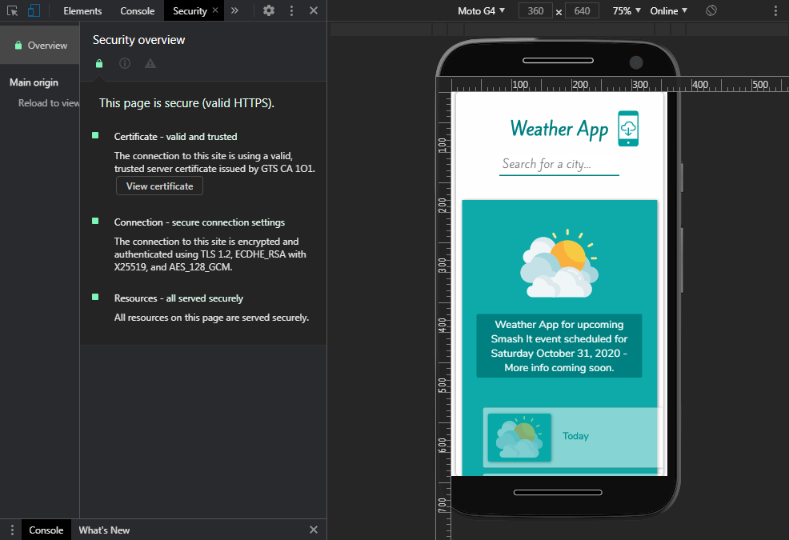

# Weather (Progressive Web) App
### About Project
Smash-It Weather app uses fetch API to fetch data from open weather map API, and is a progressive web app. Google Africa Developer Scholarship 2020 2-weeks practice project given towards the end of learning 2. Made with html, css and vanilla javascript (Instruction is that no framework should be used).
view live on [Firebase](https://weather-app-obiagba.web.app/).

#### Key features
* Installable like a native app.
* Works offline - Registers & uses service worker for cache.
* Also uses local storage to retain the last fetch on the page even on page reload.

#### Appreciation
Really learnt a lot by working on this project. Thanks to Google, Andela and pluralsight for this opportunity to participate in the Google Africa Developers Scholarship 2020 program.